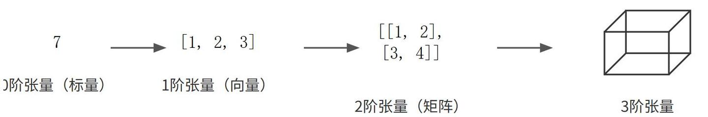

# PyTorch 基础

## 张量
张量是深度学习中的基本数据结构，可以理解为一个多维数组。矩阵是张量的一种特例。  



``` python
import torch

# 从Python列表创建一个2阶张量（矩阵）
data = [[1, 2], [3, 4]]
x_data = torch.tensor(data)

print(f"张量的值:\n {x_data}")
print(f"张量的形状 (shape): {x_data.shape}")
print(f"张量的数据类型 (dtype): {x_data.dtype}")
```

output:
```
张量的值:
 tensor([[1, 2],
        [3, 4]])
张量的形状 (shape): torch.Size([2, 2])
张量的数据类型 (dtype): torch.int64
```

张量是深度学习模型中数据流动的载体，模型的所有计算，本质上就是对张量进行各种数学计算。  

## 梯度
梯度本质上损失函数对模型参数的偏导数向量，指明了为了最小化损失，每个参数应该朝哪个方向调整（即负梯度方向下降）。在数学上，梯度方向就是数值上升最快的方向，所以我们取反方向（负梯度）去更新参数，这就是梯度下降法。  

PyTorch 通过 `torch.autograd` 自动微分引擎来计算梯度，而不用手推导数公式。  
- 计算图：当执行 `loss.backward()` 时， PyTorch 会沿着前向传播建立的计算图反向追溯，利用链式法则自动计算梯度。  
- `.gard` 属性：计算出的梯度值会累加到张量的 `.gard` 属性中，不会覆盖（为了支持大规模训练中的梯度累计策略）。  
- `requires_grad` 开关：只有将张量的 `requires_grad` 设置为 True,PyTorch 才会追踪其上的所有操作并为其计算梯度。  

注意：  
- 梯度会累计（必须手动清零）由于 `.grad` 是累加的，如果在多个训练批次中反复调用 backward() 梯度值会不断叠加。所以，每次参数更新后，需要执行 `optimizer.zero_grad()` 将梯度清零。  
- 非叶节点默认不保留梯度：为了节省显存，默认情况下 PyTorch 只保留叶子张量（即手动创建的 `requires_grad=True` 的张量）的梯度。  

计算完梯度后，梯度本身不会更新参数，它只是原材料，需要将包含梯度的参数传给优化器（Adam），由优化器根据梯度计算出更新量并执行 `optimizer.step()` 。  
所以：**梯度是 PyTorch 中指导参数更新的数学信号，由 Autograd 自动计算并暂存在 `.grad` 中，由优化器消费以迭代优化模型**   

## 计算图与自动微分

一个很简单的线性回归模型：  
设定真实规律 $y = 2 \cdot x$  
而定义当前模型 $y = w \cdot x$  
输入数据： $x=1, y = 2$ 唯一一个样本点  
``` python
# 设定一个真实的目标 w
w_true = 2
# 输入数据 x 和真实标签 y_true
x = 1.0
y_true = 2.0

# 初始化一个随机的参数 w
w = 0.5
# 设定学习率
learning_rate = 0.1

print(f"学习开始前, w = {w:.3f}")

# 进行10次迭代学习
for epoch in range(10):
    # 1. 前向传播：计算预测值
    y_pred = w * x

    # 2. 计算损失
    loss = (y_pred - y_true) ** 2

    # 3. 手动计算梯度
    grad = 2 * x * (y_pred - y_true)

    # 4. 更新权重：向梯度的反方向迈出一步
    w = w - learning_rate * grad

    print(f"第 {epoch + 1} 轮: w = {w:.3f}, loss = {loss:.3f}")
```

模型不断学习调整，让 w 从 0.5 逐步逼近真实值 2。  

对应：  
```
你的代码:  y_pred = w * x          →  几十亿参数的神经网络
你的代码:  loss = (y_pred-y_true)²  →  CrossEntropy / RLHF
你的代码:  grad = 2*x*(...)        →  autograd 自动求导
你的代码:  w = w - lr*grad         →  AdamW / SGD
```

而在 PyTorch 上的 AutoGrad:

``` python
import torch

w_true = 2
x: torch.Tensor = torch.tensor(1.0)
y_true = torch.tensor(2.0)

# 初始化w，并通过 requires_grad=True 告诉PyTorch需要追踪其梯度
w: torch.Tensor = torch.tensor(0.5, requires_grad=True)
learning_rate = 0.1

print(f"学习开始前， w = {w.item():.3f}")

for epoch in range(10):
    # 1. 前向传播
    y_pred = w * x
    # 2. 计算损失
    loss = (y_pred - y_true) ** 2

    # 3. 自动计算梯度
    loss.backward()

    # 4. 更新权重
    # w.grad 中存储了 loss 对 w 的梯度
    # 使用 torch.no_grad() 确保更新操作本身不被追踪
    with torch.no_grad():
        w -= learning_rate * w.grad

    # 清空梯度，为下一次迭代做准备
    w.grad.zero_()

    # .item() 用于从单元素张量总获取 Python 数字
    print(f"第 {epoch + 1} 轮: w = {w.item():.3f}, loss = {loss.item():.3f}")
```

之前求梯度的偏微分被 `backward()` 替代了。    


