# Q-Learning 算法

基于时序差分的强化学习算法：

时序差分更新方式：


$$
Q(s_t, a_t) \gets Q(s_t, a_t) + \alpha [R_t + \gamma \cdot \max_{a} Q(s_{t+1}, a) - Q(s_t, a_t)]
$$


时序差分误差： $R_t + \gamma \cdot \max_{a} Q(s_{t+1}, a) - Q(s_t, a_t)$  

一个强化学习算法类需要实现的方法：`take_action`、`update` 核心在 update:

```python
def update(self, s0, a0, r, s1):
    td_error = r + self.gamma * self.Q_table[s1].max() - self.Q_table[s0, a0]
    self.Q_table[s0, a0] += self.alpha * td_error
```

一个基本的 Q-Learning 类需要状态、动作、学习率，折扣因子和初始探索概率。  
Q-Learning 的学习过程就是 Q 表不断更新的过程。Q 表存储状态-动作对的统计，其记录了在每种状态下执行每一种动作可获得的未来总回报的估计值。  

## Grid World

对于网格世界，要求一个 8 * 8 的网格空间，环境类在 Q-Learning 类初始化时提供 states 和 actions，交互时每一步提供给 Q-Learning 对象

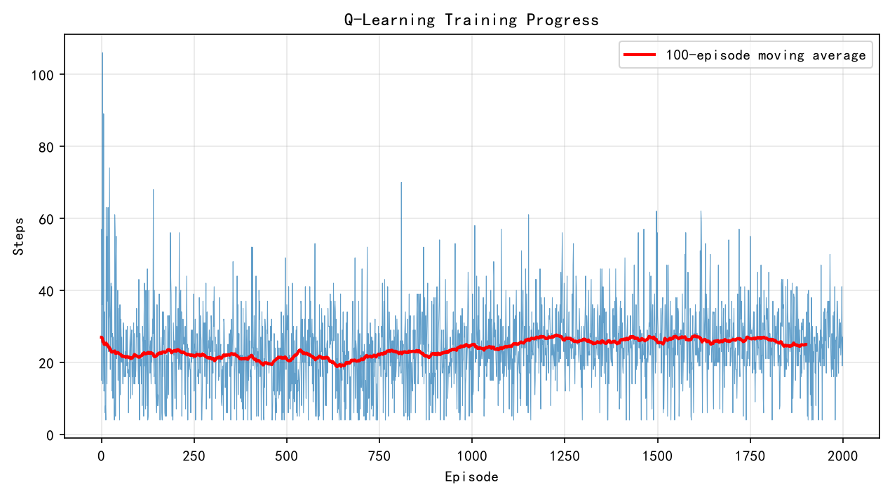

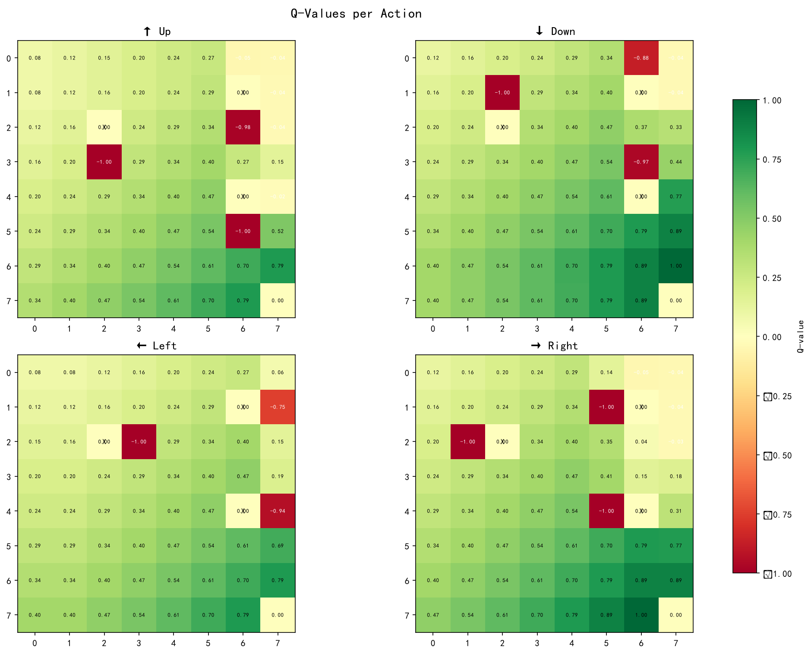

## Frozen Lake

这是 4 * 4 的网格：
如果最初的 Q 值为 0，会让智能体探索的可能降低，这里把 q 改为 5。而且这里的 td_error 基本处于负，也就是 Q 值会不断衰减。  
因为有空洞，且空间狭窄，所以很容易掉落。  

这里用 epsilon 衰减策略。保证后期主要靠经验趋于保守。  
原先我在冰面也有小奖励，但是发现这点甜头会让智能体不思进取，最后无法收敛，智能体一直在溜达。所以冰面奖励要为 0。  

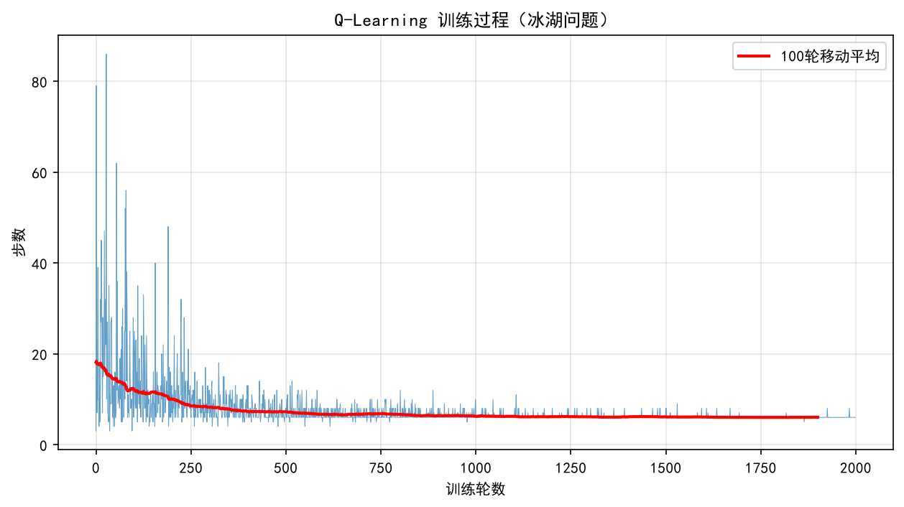

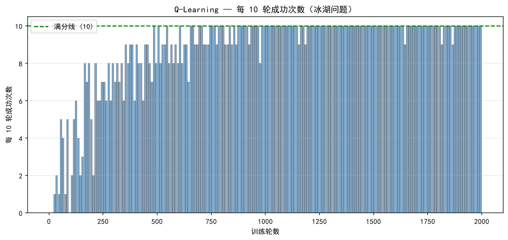

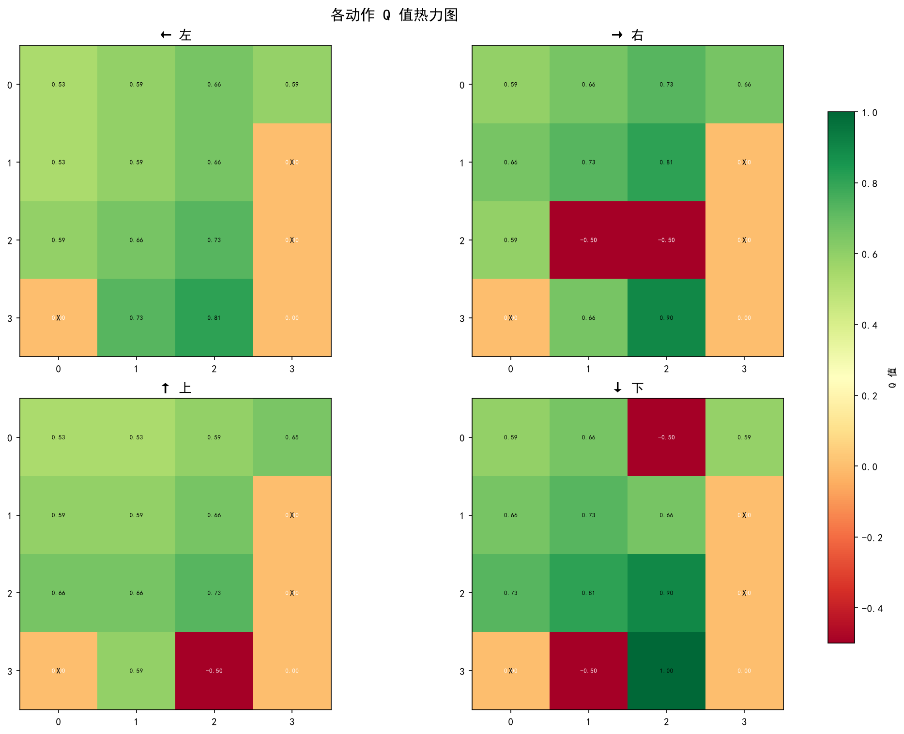

## Maze Navigation

迷宫问题，用 8 * 8 的迷宫。其实代码写的是有一定扩展性的。  
用 epsilon 衰减策略很有效地让后期智能体能快速收敛。  

地图：

```
S.#.##..
#.#.....
...#.#..
.#....#.
.###.#..
......#.
##.##...
......#G
```

提供与终点的曼哈顿距离倒数的初始化 Q 表，让最开始移动的步数会少（因为智能体有大致前进方向），但是会整体比 0 值表收敛更慢：  

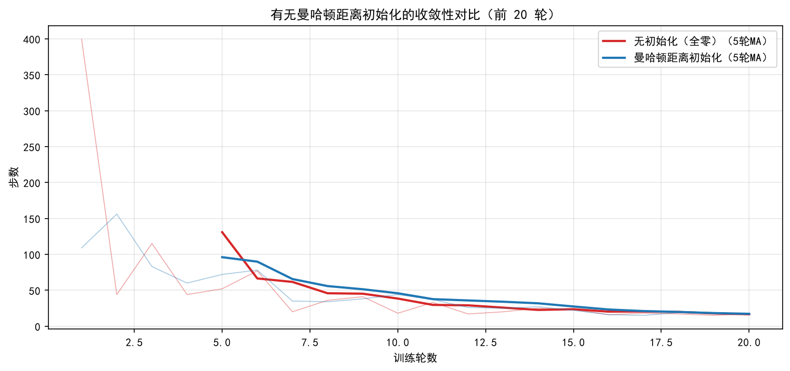

在全局 2000 轮训练周期上有无曼哈顿距离初始化实际收敛结果没差：  
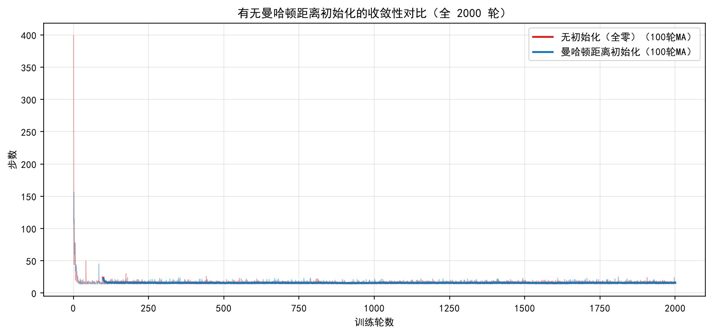

<center>
<table>
<tr>
<td>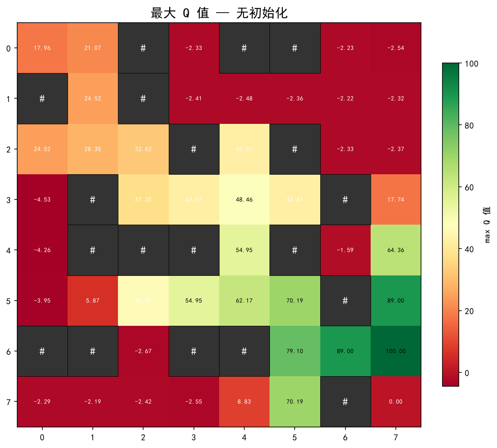</td>
<td>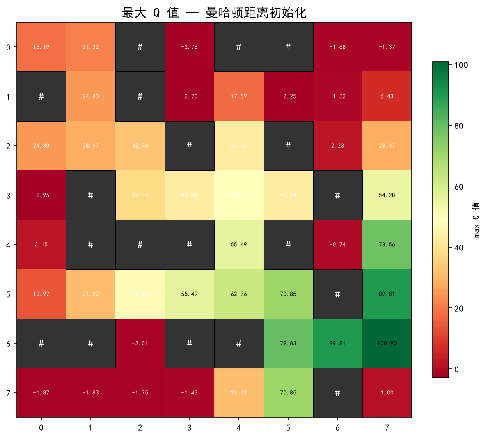</td>
</tr>
</table>
</center>
<center>
<table>
<tr>
<td>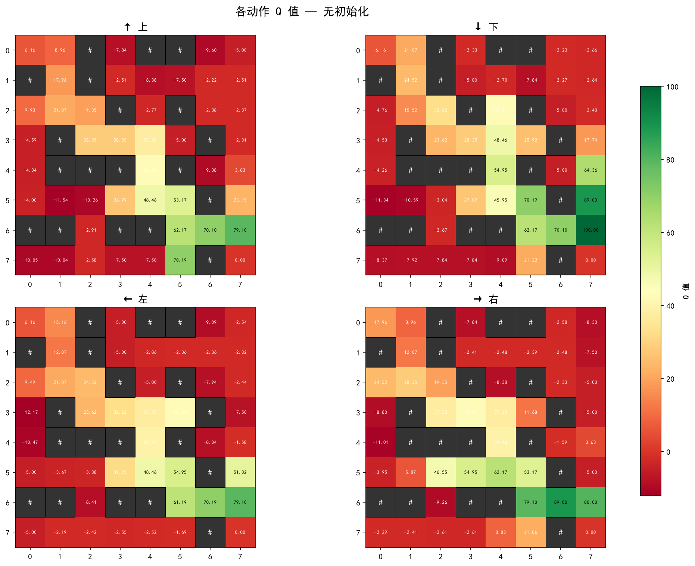</td>
<td>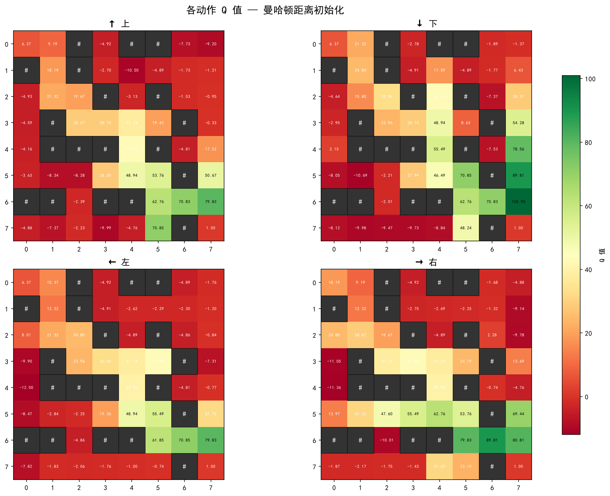</td>
</tr>
</table>
</center>

## robot dynamic path programming

在迷宫的基础上在一行设置会移动的障碍物。  
q 表除了行列还加上障碍物的位置。所以 Q 表个数为 rows * cols * cols，这样智能体就可以看到障碍物，根据障碍物的位置做出反应。  
采用 SSA 麻雀搜索算法动态调整 `learning_rate` 和 `gamma` ，不过目前每次都计算结果都不尽一致。  

地图：  

```
S...#...#
.#....#..
.........   <-- 移动障碍物所在行
...#.....
.....#...
.#.....#.
...#....G
```

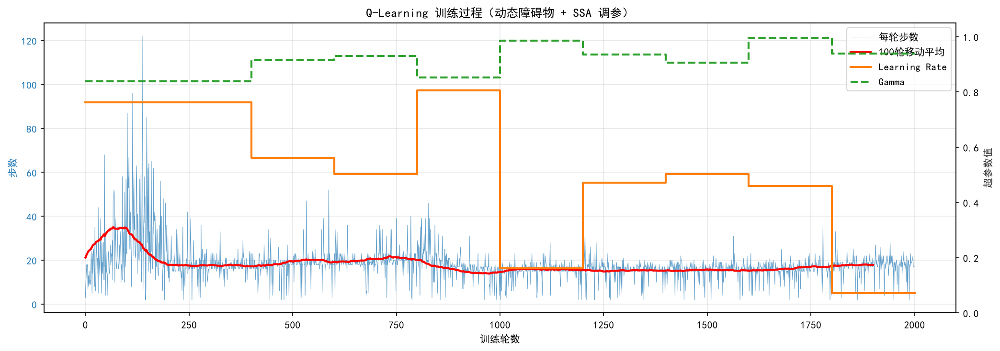

但一直到最后，都无法做到完全成功。不过这也地图过于复杂有关。  

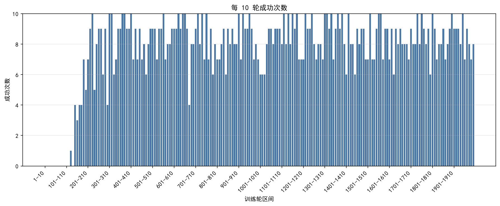

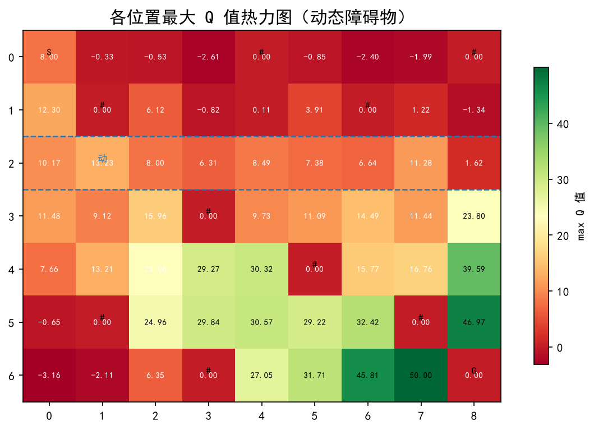
