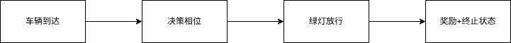
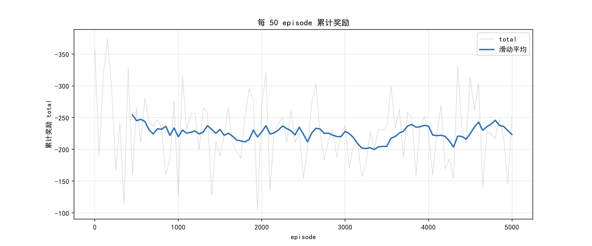
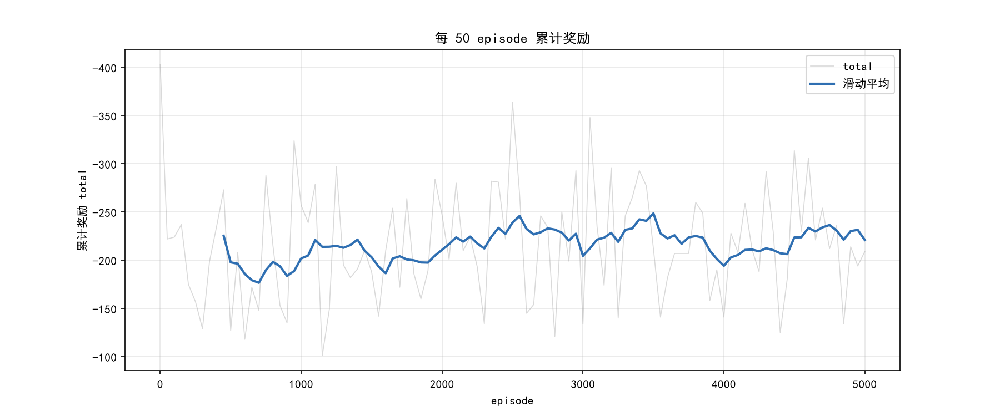

# 从简单两相位模拟到 SUMO 研究学习
## 简单两相位单路口仿真
两相位的单路口仿真核心不在于如何仿真。实际是搭建出初步的环境框架，在此基础上接入 RL 算法。  
目前主流的 RL 学习环境是基于 OpenAI 的 gym 迭代来的 Farama-Foundation/Gymnasium。比如最经典的倒立摆就是 Gymnasium 下的一个环境。Gymnasium 还提供了 `Gymnasium.Env` 这个基类来自定义环境，由此我写了一篇博客来讲关于自定义环境：[https://storm1614.top/p/gymnasium-spaces-library](https://storm1614.top/p/gymnasium-spaces-library/)  

这里的环境没有可视化，仅分南北向和东西向累计两方向各自随机而来的等候车流，车辆只能直行，不过这也足以。核心数据如下：  

``` python
self.phase = 0  # 当前绿灯相位 0/1
self.queue = [0, 0]  # 两个方向的排队分档
```

设置最大单向车流为 4 辆，再多意义不大，而且 Q 表还要再往外扩展。车流增加在 `step()` 按如下操作：  
``` python
for i in range(2):
    self.queue[i] = min(4, int(self.queue[i] + self.np_random.integers(0, 2)))
```
这样，也大致可以知道 `self.queue` 意义了。  

step 函数流程图如下，上述随机添加 queue 为车辆到达部分。  



按照 `Gymnasium API`，step 输入动作输出各种状态，其中比较重要的是观测值，也就是环境当前的各种状态。需要为环境定义当前提供给智能题的信息这里返回的是一个元组，用`_obs()` 函数进行额外的封装：  

``` python
def _obs(self):
    """
    return: 
    queue[0] 方向 A 排队数
    queue[1] 方向 B 排队数
    phase    绿灯相位
    """
    return np.array([self.queue[0], self.queue[1], self.phase], dtype=int)
```

代码在 `./qlearningRordNet.py` 。  

Q Learning 类实际很普通，无非就是选择动作、更新 Q 表两件事。因为观测值包含两向排队数和绿灯相位，所以 q 表定义的是一个四维表，不过也不复杂，索引直接按观测值 `obs` 元组进行索引即可，初始化利用 python 的元组的组合来创建。  
``` python
self.qTable = np.zeros(n_states + (n_actions,))
```
一个 state(obs) 是 3 元素的元组，这里写作 state(状态) 惯性使然，当成观测值即可。n_actions 为整形。  
可以看作：(5, 5, 2) + (2,) 相加为元组：(5, 5, 2, 2) 传给 `np.zero` 就创建出来 4 维的 `NPArray` 数据结构了。  

后续很多需要对一个观测值进行索引，直接传观测值元组即可找到匹配的两种动作的 Q 值，如下：  
```  python
action = np.argmax(self.qTable[tuple(obs)])
```

还有 espilon 收敛之类就不多展开，讲了比较多的代码细节，接下来放上训练结果。  
这里 `total` 对每次所有方向的排队数取负数进行累加，累计每 50 步放出来。`total` 越少说明训练效果越好：  



收敛结果一般般吧，不过此实验主要是把框架搭起来。  

## 引入 DQN
QLearning 的收敛结果不佳，所以就引入深度强化学习算法 DQN。需要用 pyTorch 库建立神经网络。这也导致计算量暴增。我们的环境类保持不变不做修改，仅将 QLearning 换成 DQN。这里的 DQN 也做了比较好的创新，对目标网络的更新从硬更新，一段时间深拷贝一次变成追影子式的动态更新。这在 [#3296f3f](https://github.com/storm-1614/python_studyProject/commit/3296f3fda21f9ec3afa27cd996ac8464edd9913f) 中做单独的 commit 更好的体现。  

软拷贝到目标网络更新代码为：  
``` python
for target_param, q_param in zip(self.target_q_net.parameters(), self.q_net.parameters()):
    target_param.data.copy_(self.tau * q_param.data + (1 - self.tau) * target_param.data)
```
这里的 tau 是一个很小的数值，这里为  0.007。  

除此之外，就是常规的双 Q 网络，经验回放之类可以看代码。为了和最新的 Gymnasium 框架做融合还是费了不少功夫，特别是 `torch.tensor` 张量的处理还是略显吃力。  
因为有经验回放池，加上参数也很多，给智能体 `update` 时用了字典进行传入，加上 DQN 的 update 本身就比较复杂代码写得略有些凌乱。  

``` python
if replay_buffer.size() > minimal_size:
    b_o, b_a, b_r, b_no = replay_buffer.sample(batch_size)
    transition_dict = {
        "obs": b_o,
        "actions": b_a,
        "rewards": b_r,
        "next_obs": b_no,
        "terminated": False,
        "truncated": False,
    }
    agent.update(transition_dict)
```

DQN 的收敛效果显然更好些，基本上可以收敛到最优的结果。  




## 分析现有路网与车流文件

SUMO 的配置文件关系是：  
```
sumocfg 加载 -> net.xml(地图) + rou.xml (车)  
```

`cross.sumocfg` 是总开关，`cross.net.xml` 是路网，`cross.rou.xml` 是车流。  

### net.xml
`<location>` 记录地图的坐标边界，横坐标 - 100 到 500，纵坐标 -300 到 500。  
``` xml
<location netOffset="0.00,0.00" convBoundary="-100.00,-300.00,500.00,300.00" origBoundary="10000000000.00,10000000000.00,-10000000000.00,-10000000000.00" projParameter="!"/>
```

#### `<edge>`一条路段， `<lane>` 路上的一条车道。比如：  
``` xml
<edge id="E0" from="J0" to="J1" priority="-1">
    <lane id="E0_0" index="0" speed="16.67" length="286.40" shape="-100.00,-8.00 186.40,-8.00"/>
    <lane id="E0_1" index="1" speed="16.67" length="286.40" shape="-100.00,-4.80 186.40,-4.80"/>
    <lane id="E0_2" index="2" speed="16.67" length="286.40" shape="-100.00,-1.60 186.40,-1.60"/>
</edge>
```

- `id` 为路段名  
- `from`->`to` 从哪到哪  
- `priority` 静态优先级，-1 为无信号的保底，实际是信号灯接管。  
lane 内：  
- `index` 是车道从右往左的编号
- `speed` 限速以 m/s 为单位  
- `length` 路段长度(m)  
- `shape` 几何形状

**edge 命名黄金法则：正向无负号，反向带 `-`**  
- `E0/E1/E2/E3` = 都驶入交叉口（进）  
- `-E0/-E1/-E2/-E3` = 都驶出交叉口（出）  

#### `<junction>` 交叉口：  

<!--TODO: 这里不完善-->
``` xml
<junction id="J1" type="dead_end" x="-100.00" y="0.00" incLanes="-E0_0 -E0_1 -E0_2" intLanes="" shape="-100.00,0.00 -100.00,9.60 -100.00,0.00"/>
<junction id="J1" type="traffic_light" x="200.00" y="0.00" incLanes="-E3_0 -E3_1 -E3_2 -E1_0 -E1_1 -E1_2 -E2_0 -E2_1 -E2_2 E0_0 E0_1 E0_2" intLanes=":J1_0_0 :J1_1_0 :J1_12_0 :J1_3_0 :J1_4_0 :J1_13_0 :J1_6_0 :J1_7_0 :J1_14_0 :J1_9_0 :J1_10_0 :J1_15_0" shape="190.40,13.60 209.60,13.60 210.04,11.38 210.60,10.60 211.38,10.04 212.38,9.71 213.60,9.60 213.60,-9.60 211.38,-10.04 210.60,-10.60 210.04,-11.38 209.71,-12.38 209.60,-13.60 190.40,-13.60 189.96,-11.38 189.40,-10.60 188.62,-10.04 187.62,-9.71 186.40,-9.60 186.40,9.60 188.62,10.04 189.40,10.60 189.96,11.38 190.29,12.38">
    <request index="0"  response="000000000000" foes="000000000000" cont="0"/>
    <request index="1"  response="100000000000" foes="110100010000" cont="0"/>
    <request index="2"  response="100010100000" foes="100010110000" cont="1"/>
    <request index="3"  response="000000000000" foes="000000000000" cont="0"/>
    <request index="4"  response="000010000110" foes="100010000110" cont="0"/>
    <request index="5"  response="010110000100" foes="010110000100" cont="1"/>
    <request index="6"  response="000000000000" foes="000000000000" cont="0"/>
    <request index="7"  response="000000100000" foes="010000110100" cont="0"/>
    <request index="8"  response="100000100010" foes="110000100010" cont="1"/>
    <request index="9"  response="000000000000" foes="000000000000" cont="0"/>
    <request index="10" response="000110000010" foes="000110100010" cont="0"/>
    <request index="11" response="000100010110" foes="000100010110" cont="1"/>
</junction>
```
- `J1 type="traffic_light"` 唯一带红绿灯的节点。  
- `J0-J4 type="dead_end` 地图边缘
- `:J1_12_0 type="internal"` 交叉口内部节点  

#### `<connection>` 
``` xml
<connection from="-E1" to="E3" fromLane="0" toLane="0" via=":J1_3_0" tl="J1" linkIndex="3" dir="r" state="O"/>
```
这句的意思是从 `-E1` 的第 0 车道出发，可以转到 `E3` 的第 0 车道。  
- `dir` 这个转弯时直行(s)、右转(r)、左转(l)  
- `linkIndex="N"` 这个转弯代表信号灯的哪一位，即 N。也就是 12 位 state 字符串的第 N 位。  

#### `<tlLogic>` 红绿灯
``` xml
<tlLogic id="J1" type="static" programID="0" offset="0">
    <phase duration="33" state="GGgGrrGGgGrr"/>
    <phase duration="3"  state="yygyrryygyrr"/>
    <phase duration="6"  state="rrGrrrrrGrrr"/>
    <phase duration="3"  state="rryrrrrryrrr"/>
    <phase duration="33" state="GrrGGgGrrGGg"/>
    <phase duration="3"  state="yrryygyrryyg"/>
    <phase duration="6"  state="rrrrrGrrrrrG"/>
    <phase duration="3"  state="rrrrryrrrrry"/>
</tlLogic>
```

- `id` 信号灯控制的交叉口  
- `type="static` 固定配时
- `duration` 这个相位持续多少秒
- `state` 12 字符对应 12 个信号灯头(connection 的 linkIndex 0-11)

state 字符含义：  
- `G` 绿灯/ `g` 绿灯（车流路口的保护绿，等同于 G
- `y` 黄灯
- `r` 红灯

例如： `<phase duration="33" state="GGgGrrGGgGrr"/>`
这里第一位 `G`=linkIndex 0 绿灯  
第 4 位 `G`，第 7-8 位的 GG……  

信号灯的 12 位字符串信号灯头，其是 connection 的参数，
```
<phase duration="33" state="GGgGrrGGgGrr"/>
按位对号入座，把 12 个灯头的当前灯色列出来：

位:     0   1   2   3   4   5   6   7   8   9  10  11
state:  G   G   g   G   r   r   G   G   g   G   r   r
方向:   北右 北直 北左 东右 东直 东左 南右 南直 南左 西右 西直 西左
灯:     绿  绿  绿  绿  红  红  绿  绿  绿  绿  红  红

读法：第 0 位的 G，意思就是"北→西右转这个灯头现在是绿灯"。
```

每 3 位是一个进口方向的右转、直行、左转。

### rou.xml
描述的是什么时候、放什么车、走哪条路。  
`<routes>...</routes>` 里面的子元素按固定顺序：`vType` -> `route` -> `vehicle` ，SUMO 要求先定义车型和路径，再确定某辆车用哪个车型走哪条路。  
#### `<vType>` 车型定义
``` xml
<vType id="passenger" vClass="passenger" maxSpeed="16.67" accel="2.6" decel="4.5" sigma="0.5" length="5.0" color="1,1,0"/>
<vType id="truck" vClass="truck" maxSpeed="16.67" accel="1.2" decel="2.5" sigma="0.5" length="12.0" color="1,0,0"/>
```

- `vClass` 车辆类型
- `maxSpeed` 最大车速 m/s
- `accel` 加速度
- `decel` 减速度
- `length` 车长
- `color` GUI 颜色

#### `<route>`  路径定义
``` xml
<route id="N_S" edges="-E3 E2"/>  <route id="S_N" edges="-E2 E3"/>  <route id="E_W" edges="-E1 -E0"/> <route id="W_E" edges="E0 E1"/>    
```

只有四条路，方向就是 id 名  
比如 `<route id="N_S" edges="-E3 E2"/>` 就是北入南出。net 定义可以走的路，rou 选择走哪些。  

#### `<vehicle>` 具体车辆
例如：  
``` xml
<vehicle id="passenger_1" type="passenger" route="S_N" depart="25" departLane="random" departSpeed="14.26" />
```
- `id` 每辆车唯一名字，在 TriCi 要用这个名字操控它  
- `type` 用的哪个 `<vType>`  
- `route` 走哪条 `<route>`  
- `depart` 什么时候进入道路，单位：秒  
- `departLane` 出现在哪一车道,random:随机车道  
- `departSpeed` 初速度 m/s  

`<vehicle>` 实际是一份发车时间表。  

### 交通工程核心概念
#### 制动距离
车辆以当前速度、以最大减速度刹车到完全停下所滑过的距离。  

$$
S=\frac{v^2}{2a}
$$

- $S$ 制动距离
- $v$ 初始制动速度
- $a$ 平均减速度  

在判断绿灯变黄/红 时，某辆车能不能在停止线前停下，不能停就让它走，否则就是急刹甚至闯黄。  

#### 黄灯困境区
黄灯亮起瞬间，车辆处于一段进退两难的位置区：  
- 若继续前冲，可能来不及在停止线前停下
- 若急踩刹车，可能根本不够距离刹稳  

定量：黄灯开始时，车离停止线的距离同时小于制动距离且大于按当前速度在黄灯时长能走的距离。  

#### 碰撞时间 TTC
如果两车保持当前速度和反向不变，再过几秒就会撞上。  

$$
TTC = \frac{D}{V_{rel}}
$$

- $D$ 两车之距
- $V_{rel}$ 相对速度，后车速度 - 前车速度  

TTC 越小越危险，通常 TTC > 3s 比较安全。  

#### 后侵入时间 PET
前后两辆车先后通过同一冲突点时的时间差。  
PET = 第二辆车到达冲突点时刻 - 第一辆离开冲突点时刻。  

#### 相位切换惩罚
信号灯每切换一次相位/改变一次灯色所付出的代价（冲突风险，延误增加……）  

#### 最小绿灯时间
设定下限，保证绿相位至少放行能启动的那批车。  
